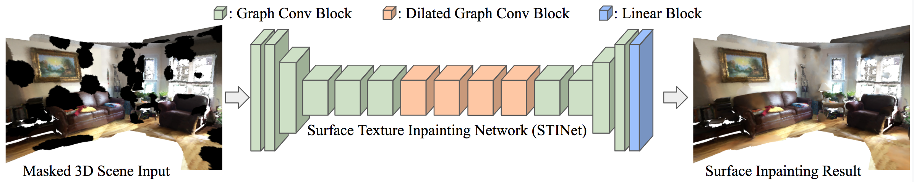

# Surface Texture Inpainting Using Graph Neural Networks
Inpainting with deep learning looks great these days but what if the pixels live on a 3D model instead of a flat, rectangular image? :thinking:

**Docs: [Thesis](docs/flynn_thesis_final.pdf) | [Video 1](https://youtu.be/xjIRtMGdiQU) | [Video 2](https://youtu.be/BTlt3wAWSb0)**


<p align="center">

</p>

We present the Surface Texture Inpainting Network (STINet), a graph neural network-based model that generates complete surface texture for partially textured 3D meshes. In contrast to 2D image inpainting which focuses on predicting missing pixel values on a fixed regular grid, STINet aims to inpaint color information on mesh surfaces of varying geometry and topology. STINet learns from spatial information such as vertex positions and normals as well as mesh connectivity to effectively predict vertex color. Through experiments on 2D textures and real-world 3D reconstructions, we demonstrate the potential of STINet to inpaint two-dimensional manifolds with results that are perceptually comparable to classic 2D convolutions. To our knowledge, this is the first work to utilize graph neural networks for surface texture completion.

<p align="center">

</p>

_This repository contains a PyTorch implementation of STINet capable of running on the [ScanNet](https://github.com/ScanNet/ScanNet) dataset._

## Installation

Clone this repo.
```bash
https://github.com/johnpeterflynn/surface-texture-inpainting-net
cd surface-texture-inpainting-net
```

Create a new conda environment containing PyTorch, replacing <env_name> with a name of your choice. 
```bash
conda create -n <env_name> -c pytorch pytorch torchvision python=3.9
```

Ensure you are using pip within your virtual environment.
```bash
conda install pip
```

Install packages from requirements.txt. This will also install necessary libraries such as OpenCV and Open3D. PyTorch Geometric (pyg) must be installed separately. 

```bash
pip install -r requirements.txt
conda install pyg -c pyg
```

To generate mesh simplification levels we utilize tridecimator during preprocessing. Tridecimator is contained in our fork of [VCGLib](https://github.com/cnr-isti-vclab/vcglib) which is a submodule of this repository.


```bash
git submodule update --init --recursive
scripts/install_vcglib.sh
```

## Dataset Preparation

### 3D Dataset: ScanNet

In our experiments we use ScanNet, a dataset containing 3D reconstructions of 1500 indoor scenes.

#### Download ScanNet

Please refer to https://github.com/ScanNet/ScanNet to gain access to the ScanNet dataset. It could take a few days to be granted access.

Our scripts only rely on ScanNet's low-resolution meshes. You can download these by specifying the file type _\_vh_clean_2.ply_ in the download script provided by ScanNet.

#### Symbolic link pointing to dataset

Once you've downloaded ScanNet you should link this project to them by placing a symbolic link within this project directory.

```bash
ln -s /path/to/downloaded/scannet/files data/scannet
```

### 2D Dataset: Images of Textures

Unfortunately our texture dataset is not publically available. If you would like to build your own you can aggregate images of textures from the following smaller datasets.

## Run Preprocessing and Training

We provide scripts to preprocess ScanNet scenes and train STINet. Each experiment subfolder contains a configuration file used for training. Modify these scripts and the configuration files to set up your own training and inference pipelines.

#### 2D Image Inpainting

```bash
experiments/2d_inpainting/run_2d_inpainting.sh
```

#### 3D Surface Inpainting

NOTE: Preprocessing each ScanNet scene takes roughly 30 minutes but processing scenes can be distributed amongst available CPU cores.

```bash
experiments/3d_inpainting/preprocess_3d_inpainting.sh
experiments/3d_inpainting/run_3d_inpainting.sh
```

## Visualization
The visualization tool is based on [open3D](http://www.open3d.org/) and handles the following key events:
* k = ground truth
* j = prediction
* m = mask
* f = error heat map
* l = local lighting on/off
* s = smoothing mesh on/off
* b = back-face culling on/off
* p = take a screenshot
* d = save ground truth, mask and prediction meshes as .ply in `visualizations/` folder
* q = quit and show next room

## Acknowledgements

This project structure is based on the [PyTorch-Template](https://github.com/victoresque/pytorch-template) by [@victoresque](https://github.com/victoresque).

Much of this code was inspired by [Jonas Schult's](https://github.com/JonasSchult) work [DualConvMesh-Net](https://github.com/VisualComputingInstitute/dcm-net).

Many thanks to [Matthias Fey](https://github.com/rusty1s) and the [PyTorch Geometric](https://pytorch-geometric.readthedocs.io/en/latest/) team!
